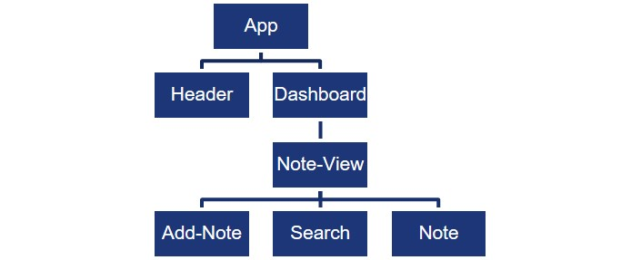
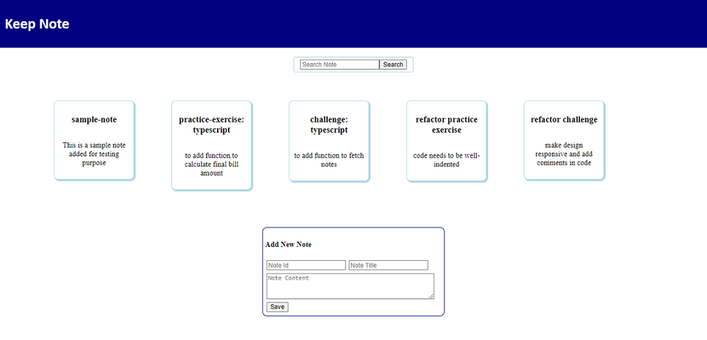

## Challenge - Keep Note

#### Context

Keep Note is a web app that allows user to maintain notes. 

The app should be designed as a single page application.

Based on SPA approach, the app should be developed by creating components.

In the current phase of development, the app should read notes residing externally in the form of an array.

The app should update this array, when user adds new notes.

For the convenience, the app should provide search functionality to allow user to search notes by note title.

The tasks of creating new note and displaying notes should be handled by separate components as guided by single responsibility principle.

In the current phase of development, the note data is not persisted to any permanent storage but instead stored as in-memory data structures – the Array.​

Persistence would be implemented in next phase of development.

#### Task 1 - Create Data Models
- Create Angular application named `keep-note` using Angular CLI command:
    
    `ng new --skip-tests keep-note`
- Create data models under folder with name `models`
- Create type `Note` in `note.ts` file in `models` folder with following type properties:
    - id (number)
    - title (string)
    - content (string)
- Create constant `Notes` in `notes.ts` file in `models` folder.
    - The `Notes` constant should store array with following notes data:

    | id  | title                         | content                                         |
    | --- | ----------------------------- | ----------------------------------------------- |
    | 1   | sample-note                   | This is a sample note added for testing purpose |
    | 2   | practice-exercise: typescript | to add function to calculate final bill amount  |
    | 3   | challenge: typescript         | to add function to fetch notes                  |
    | 4   | refactor practice exercise    | code needs to be well-indented                  |
    | 5   | refactor challenge            | make design responsive and add comments in code |

#### Task 2 - Create Components
- Create components as shown in component hierarchy diagram below:

    
- Use Angular CLI command `ng generate component <component-name>` or `ng g c <component-name>` to create components.
- Render the components using component selector as per the hiearchy. 
    - `App` component should render `Header` and `Dashboard` components.
    - `Dashboard` component should render `Note-View` component.
    - `Note-View` component should render `Add-Note`, `Search` and `Note` components.

#### Task 3 - Design App Header
- Modify `Header` component to display the app title `Keep Note`.

#### Task 4 - Display Notes
- `Note-View` component should read notes from `NOTES` array defined in `Notes.ts` file.
- The `Note-View` component should traverse the `notes` array using `*ngFor` directive and render `Note` component for each note traversed, passing the `note` element of the array as input to `Note` component.
- The `Note` component should declare `note` as input property (using `@Input()` decorator) to receive input from `Note-View` component.
- The `Note` component should render properties (title and content) of `note` object to display note data.

#### Task 5 - Search Note
- Design UI for `search` component that contains search text box and a button.
- The component should define `searchText` as the property.
- Implement 2-way binding between template and component property for `searchText` using `ngModel`.
- Define method `searchNote()` in component class, that gets called when the search button is clicked.
- Declare output property `searchTextChanged` that will be used to emit event with `searchText` value when the `search()` method is called.
- The event `searchTextChanged` should be listened by the parent component `Note-View`.
- Define method `onSearchTextChanged()` in `Note-View` component that gets called when `searchTextChanged` event is triggered.
- The method `onSearchTextChanged()` should filter the `notes` array with only those notes that include `searchText` in its title. If the `searchText` is empty, it should display all notes.
- As the `notes` property gets modified, the `note-view` component renders `note` components with the modified notes data.

#### Task 6 - Add New Note
- Design UI for `add-note` component that accepts `id`, `title` and `content` values for `note` from user.
- The UI should contain button which when clicked calls the `addNote()` method to save the inputted details in `NOTES` array defined in `notes.ts` file.
- Declare `note` property of type `note` in component class and implement 2-way binding between its properties with template properties.
- As the `NOTES` array  gets modified, the `note-view` component which is reading the values of this array in its `notes` property, renders `note` components with the modified notes data.
- **Note: Since, persistence is not implemented, upon refreshing the page, newly added note data will get removed.**

**Note**
1. Style the components by defining CSS classes in their respective `.css` file for better look and feel.
2. The sample layout suggested for the `Keep Note` app is provided in the image below:

